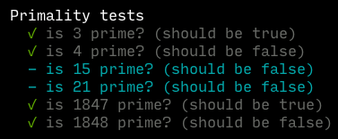

# Mocha Table

  

  

Table-driven tests for [Mocha](https://mochajs.org/). Lets you easily
specify data-driven tests with nice test names. Allows for easy focus
and skipping of individual test entries.

## In Node.js

[sprintf.js](https://github.com/alexei/sprintf.js) is used to
interpolate a template, resulting in nice test names for each table
entry.  The string template (the second argument to `describeTable`) is
fed the values that are given to the test function (the third
argument).

    const {tableTest, tableEntry} = require('mocha-table')

    describe('Primality tests', function() {
      tableIt('finds %d prime? (%t)', function (number, result) {
        expect(isPrime(number)).to.equal(result)
      })

      tableEntry(2, true),
      tableEntry(3, true),
      tableEntry(4, false),
      tableEntry(1847, true),
      tableEntry(1848, false)
    })

## In the browser

Here's a simple HTML test harness:

    <html>
    <head>
        <meta charset="utf-8">
        <title>Mocha Table Tests</title>
        <link href="https://unpkg.com/mocha@5.2.0/mocha.css" rel="stylesheet" />
    </head>
    <body>
    

    
    
    

    
    
    
    
    </body>
    </html>

Given a `prime.js` like this:

    // My amazing O(1) primality tester.
    // Works for the majority of primes!!
    function isPrime (n) {
      return (n === 2 || n / 2 !== Math.floor(n / 2)) &&
        (n === 3 || n / 3 !== Math.floor(n / 3))
    }

A table-driven test `prime.test.js` file looks like:

    const mochaTable = require('mocha-table')
    const describeTable = mochaTable.describeTable
    const xentry = mochaTable.xentry
    const entry = mochaTable.entry

    const expect = chai.expect
    describe('prime tester', function () {
      describeTable('Primality tests',
                    'is %d prime? (%t)',
                 function (number, result) {
                   expect(isPrime(number)).to.equal(result)
                 },
                 entry(3, true),
                 entry(4, false),
                 entry.skip(15, false),
                 xentry(21, false),
                 entry(1847, true),
                 entry(1848, false)
                )
    })

This snippet demonstrates the use of `xentry` and `entry.skip` to mark
some pesky tests that haven't been fixed yet. An entry can be focused
programmatically using `.only` to mark it:

    ...
    entry.only(3, true),
    ...

## Building from source

Mocha Table uses [Browserify](http://browserify.org/) to create a
version that's easily usable on the web (via
[jsDelivr](jsdelivr.com)). Make sure any changes to `index.js` are
reflected in the built asset:

npm run build
